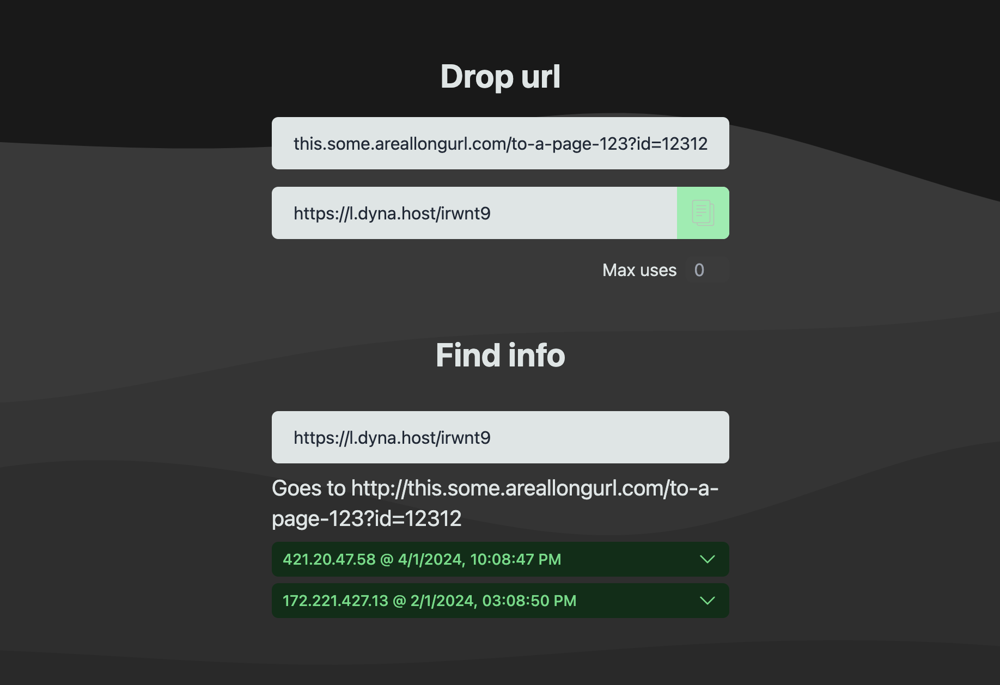

# Make long url short

nuxt3 + postgres in docker compose  
this is made for private use and is not meant to serve the public


## start

`docker compose up -d`

generate tables (needed 1st time):

```
docker exec -it shortr-app bash
npx prisma db push
```

## endpoints

### POST `/url`

```
{"url":"abi.co","maxReads":0}
```

```
200 [id]
500 "error"
```

### GET `/api/url?id=[id]`

```
200 [url]
500 "error"
```

### GET `/api/urlinfo?id=[id]`

```
200 [id, url, ip, ua, maxreads, reads with ip and ua]
500 "error"
```
